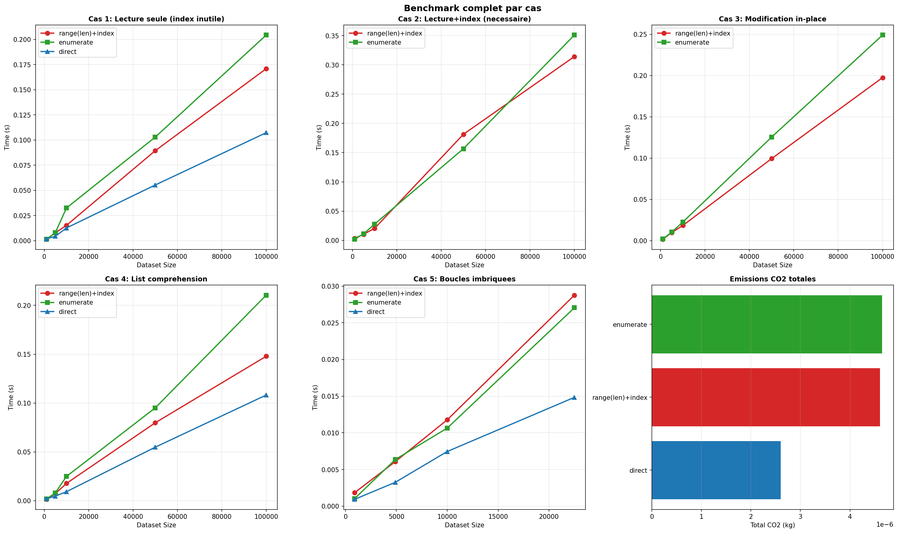
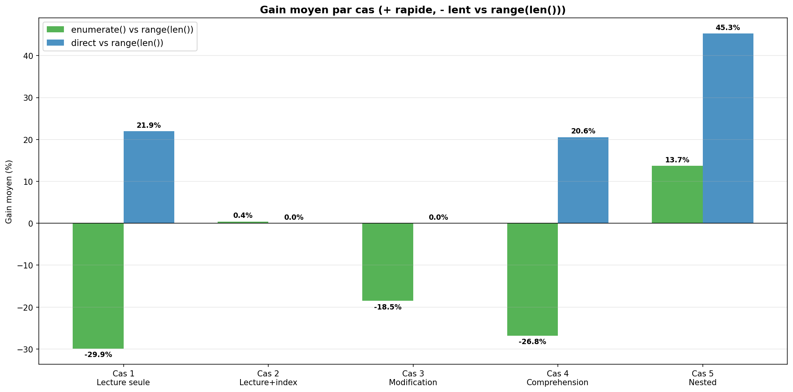

Avoid the `range(len())` pattern. Prefer direct iteration or `enumerate()` which avoids costly index-based access.

== Why is this an issue?

Using `for i in range(len(sequence))` forces index-based access (`sequence[i]`) which is significantly slower than direct iteration using Python's iterator protocol (implemented in C). Benchmarks show *17-40% CPU savings* when using direct iteration instead.

* Index-based access (`sequence[i]`) requires `__getitem__` call + bounds checking at each iteration
* Direct iteration uses `__next__()` optimized in C
* The pattern encourages developers to use index access when it is not needed

== Noncompliant Code Example

[source,python]
----
my_list = [1, 2, 3, 4, 5]
for i in range(len(my_list)):  # Noncompliant
    print(i, my_list[i])

result = [data[i] * 2 for i in range(len(data))]  # Noncompliant
----

== Compliant Solution

[source,python]
----
my_list = [1, 2, 3, 4, 5]

# When you need the index AND the value
for i, item in enumerate(my_list):  # Compliant
    print(i, item)

# When you only need the value (fastest)
for item in my_list:  # Compliant
    print(item)

# List comprehension
result = [val * 2 for val in data]  # Compliant
----

== Relevance Analysis

The following results were obtained through local experiments.

=== Configuration

* CO2 Emissions Measurement: Using CodeCarbon

=== Test Execution

