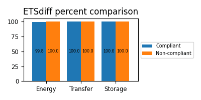

:!sectids:

== Why is this an issue?

Using `try...catch` blocks for predictable operations (such as file opening) creates unnecessary overhead.
When an exception is thrown, the exception object itself consumes CPU cycles and RAM for its creation and destruction.
For simple, testable conditions (e.g., checking if a file exists), logical checks (like `os.path.isfile`) are more efficient and avoid the performance cost of exception handling.

This rule currently focuses on the "file open" use case, but the principle applies to other predictable scenarios (e.g., loops, data constructions).

== Examples

=== Noncompliant

[source,php,data-diff-id="1",data-diff-type="noncompliant"]
----
try
{
  $picture = PDF_open_image_file($PDF, "jpeg", $imgFile, "", 0); // This is the original statement, this works on PHP4
}
catch(Exception $ex)
{
  $msg = "Error opening $imgFile for Product $row['Identifier']";
  throw new Exception($msg);
}
----

=== Compliant

[source,php,data-diff-id="1",data-diff-type="compliant"]
----
//try
if (file_exists($imgFile)) {
    $picture = PDF_open_image_file($PDF, "jpeg", $imgFile, "", 0);
}

//catch
if (!$picture) {
   $msg = "Error opening $imgFile for Product $row['Identifier']";
   print $msg;
}
----

== Resources

include::../../etsdiff-methodology.asciidoc[]

=== Case for a 1GB database:

[format=csv,cols="1h,1,1"]
|===
Source of impacts,Compliant,Non-compliant

include::1GB.etsdiff.csv[]
|===
