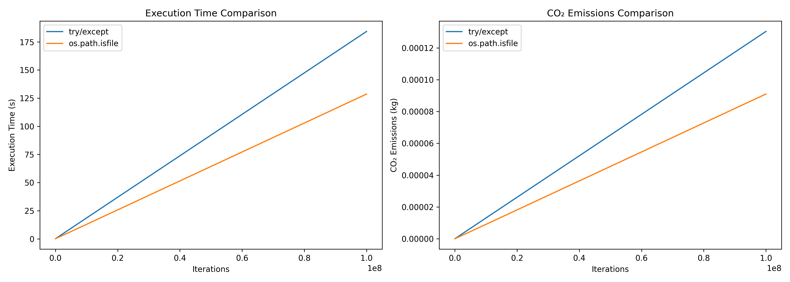

Inside complex code parts (for example multiple loops, complex data constructions...), avoid using try...catch.
For the moment, this rule only deals with "file open" use case in try...catch blocks.

When an exception is thrown, a variable (the exception itself) is created in a catch block, and it's destruction consumes unnecessary CPU cycles and RAM. Prefer using logical tests in this cases.

== Non compliant Code Example

[source,python]
----
try : 
    with open(path, "r") as f:
        _ = f.read()
except : 
    pass
----

== Compliant Code Example

[source,python]
----
if os.path.isfile(path):
    with open(path, "r") as f:
        _ = f.read()
----

== Experimental Verification

The rule was evaluated using:

* CodeCarbon to estimate CO₂ emissions
* execution time measurements
* multiple iteration scales to simulate real execution contexts

=== Configuration

[source,python]
----
from codecarbon import EmissionsTracker
import matplotlib.pyplot as plt
import os
import time

path = ('text.txt') # the famous file not founded
----

=== Non compliant Implementation

[source,python]
----
#function who use the no compliant_solution
def no_compliant_solution():
    for i in range(nb_runs): 
        try : 
            with open(path, "r") as f:
                _ = f.read()
        except : 
            pass
----

=== Compliant Implementation

[source,python]
----
#function who use the compliant solution
def compliant_solution():
    for i in range(nb_runs): 
        if os.path.isfile(path):
            with open(path, "r") as f:
                _ = f.read()

----

=== Measurement Function

[source,python]
----
# function to measure the impact of the both solutions
def measure(function): 
    start_time = time.time()
    tracker = EmissionsTracker()
    tracker.start()

    function()
    end_time = time.time()

    emission = tracker.stop()
    full_time = end_time-start_time

    return emission, full_time

print(f"Emisssion no compliant solution :{no_emission_compliant_solution:.2e}")
print(f"Time for no compliant solution :{no_time_compliant_solution:.2f}")

print(f"Emisssion compliant solution : {emission_compliant_solution:.2e}")
print(f"Time for compliant solution :{time_compliant_solution:.2f}")
----

=== Initial Results

Emisssion no compliant solution : 2.76e-05
Time for no compliant solution : 39.21

Emisssion compliant solution : 1.86e-05
Time for compliant solution : 26.35

The compliant solution shows:

    * lower execution time
    * lower CO₂ emissions
    * reduced unnecessary resource consumption

== Large-Scale Iteration Analysis

To simulate real-world execution scenarios, the two implementations were tested with increasing numbers of iterations.

[source,python]
----
#Code to show the impact with a simulation of a real context 
runs = [100, 500, 1000, 5000, 10000, 100000, 1000000, 10000000, 100000000]
times_no = []
times_yes = []
em_no = []
em_yes = []

for r in runs:
    nb_runs = r
    e1, t1 = measure(no_compliant_solution)
    e2, t2 = measure(compliant_solution)

    times_no.append(t1)
    times_yes.append(t2)
    em_no.append(e1)
    em_yes.append(e2)

plt.plot(runs, times_no, label="try/except")
plt.plot(runs, times_yes, label="os.path.isfile")
plt.xlabel("Iterations")
plt.ylabel("Time (s)")
plt.legend()
plt.show()

plt.plot(runs, em_no, label="try/except")
plt.plot(runs, em_yes, label="os.path.isfile")
plt.xlabel("Iterations")
plt.ylabel("CO2 emissions en kg")
plt.legend()
plt.show()
----

=== Results

The emissions trend follows the same behavior as execution time:

* the try/except implementation consistently produces more emissions
* the gap increases with the number of iterations
* avoiding unnecessary exceptions improves energy efficiency

== Conclusion

Using try/except blocks to manage expected situations such as missing files introduces avoidable overhead in Python applications.

In repetitive or performance-sensitive code paths:

* exception handling increases execution time
* unnecessary object creation consumes additional resources
* higher CPU usage leads to greater energy consumption and CO₂ emissions