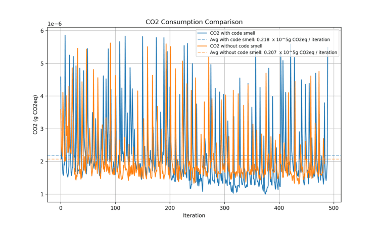
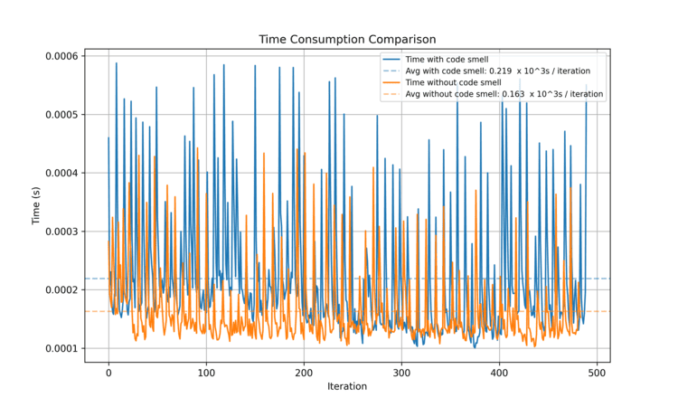
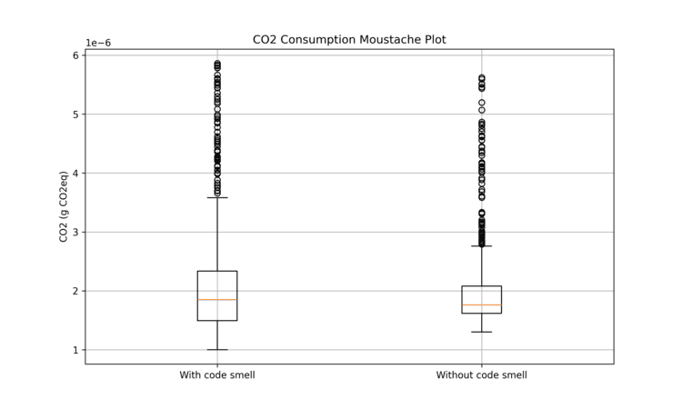
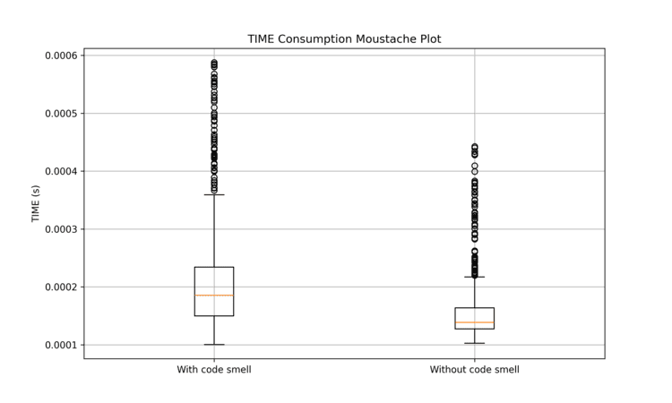
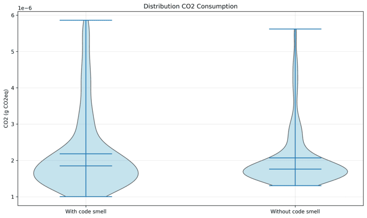
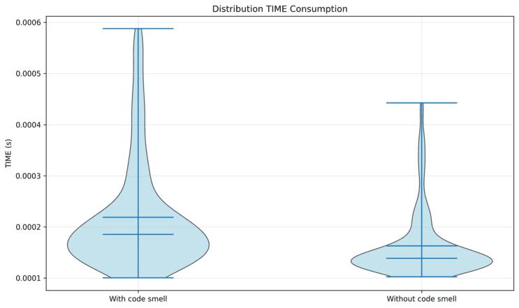

:!sectids:

== Why is this an issue?

Accessing global variables requires scope resolution, which consumes additional CPU cycles.
Passing global variables as function parameters treats them as local variables, reducing lookup overhead.

Thus, prefer local variables as parameters.

== Examples

=== Noncompliant

[source,python,data-diff-id="1",data-diff-type="noncompliant"]
----
global_var = 'foo'
def print_global_var_details():
    print(len(global_var)) # Noncompliant
    print('Global var : ', global_var) # Noncompliant
    print('Global var : ' + global_var) # Noncompliant
print_global_var_details()
----

=== Compliant

[source,python,data-diff-id="2",data-diff-type="compliant"]
----
global_var = 'foo'
def print_var_details(local_var):
    print(len(local_var))
    print('Var : ', local_var)
    print('Var : ' + local_var)
print_var_details(global_var)
----

== Analysis

=== Energy Measurement

Measurements were performed using https://github.com/green-code-initiative/EnergyTracer[green-code-initiative/EnergyTracer]

==== Instance Info

 * `os`: Linux 6.17.0-23-generic
 * `machine`: x86_64
 * `chip`: Intel(R) Core(TM) Ultra 7 255H
 * `RAM`: 32 GB

==== Code used in the test

Non compliant Code

[source,python]
----
global_var = 'foo'
def print_global_var_details():
    print(len(global_var)) # Noncompliant
    print('Global var : ', global_var) # Noncompliant
    print('Global var : ' + global_var) # Noncompliant
print_global_var_details()
----

Compliant code

[source,python]
----
global_var = 'foo'
def print_var_details(local_var):
    print(len(local_var))
    print('Var : ', local_var)
    print('Var : ' + local_var)
print_var_details(global_var)
----

==== Global Consumption
|===
|  | With smell | Without smell
| **Execution Time** | 2.0e-4 s | 1.5e-4 s
| **Average Power** | 259.932 W | 331.044 W
| **Total Energy** | 25.97 J | 23.99 J
|===

==== Plot

Energy

  

Box plot

  

Violin plot

  

==== Statistical Analysis
|===
|Metric|Δ mean|p-value|Cohen’s d|Effect|Sig.
| `cpu_mj` | +5.85% | 0.0167 | +0.156 | negligible | ✅
| `co2_eq` | +5.86% | 0.0165 | +0.156 | negligible | ✅
| `dram_mj` | +5.87% | 0.0165 | +0.156 | negligible | ✅
| `time_s` | +26.09% | 7.33e-28 | +0.740 | medium | ✅
|===

==== Verdict
Removing the code smell leads to measurable energy differences:

- **`time_s`**: 26.1% lower time (Cohen’s d = +0.740, medium)

[quote]
Δ mean = (mean_with − mean_without) / mean_with × 100. Positive → the smell consumes more energy.
