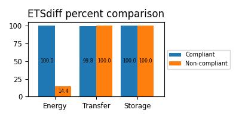

:!sectids:

== Why is this an issue?

The form `$i++` creates a temporary variable whereas `++$i` does not. It saves CPU cycles.

== Examples

=== Noncompliant

[source,php,data-diff-id="1",data-diff-type="noncompliant"]
----
$i++
----

=== Compliant

[source,php,data-diff-id="2",data-diff-type="compliant"]
----
++$i
----

include::../../etsdiff-methodology.asciidoc[]

== Case for a 1GB database:

[format=csv,cols="1h,1,1"]
|===
Source of impacts,Compliant,Non-compliant

include::1GB.etsdiff.csv[]
|===
