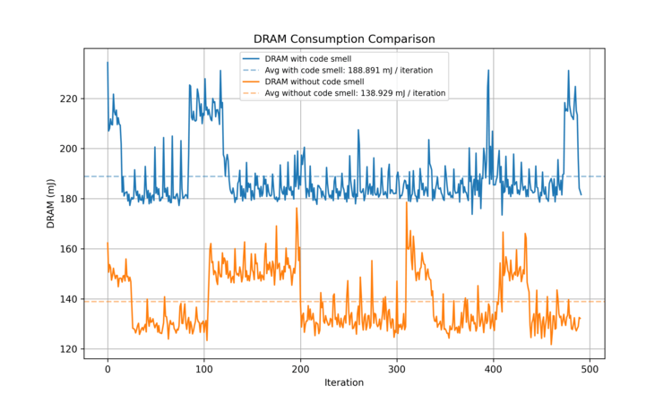
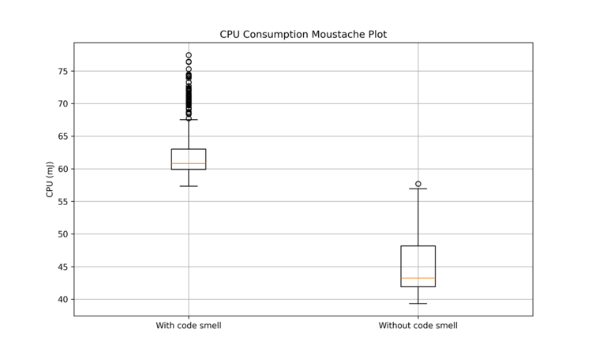
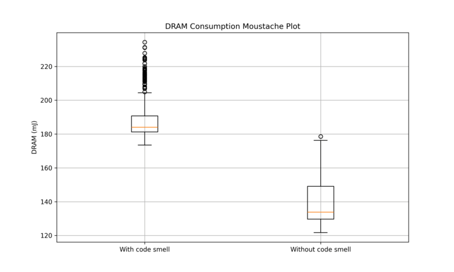
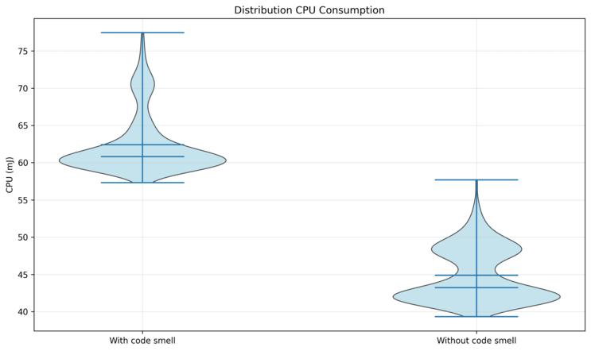
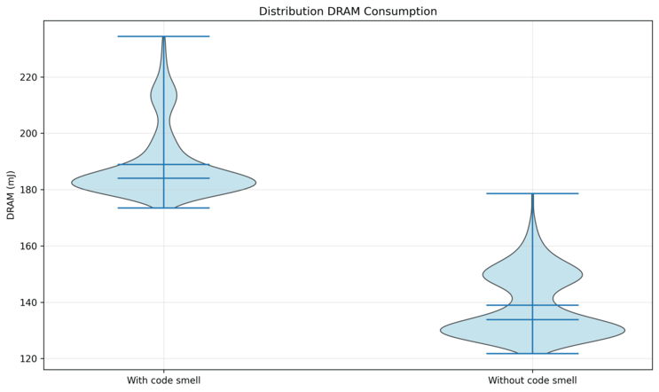

Python doesn't have TTL on cache with default libraries.

With functools library @cache acts the same way than @lru_cache(maxsize=None).
@lru_cache(maxsize=None) create an unlimited cache and must be a source of memory leak, an unlimited cache can take a lot of RAM / Disk space, resulting to a big energy consumption.

By default, lru_cache set the size of cache to 128 entries.

In this case, the cache is unlimited which is suspect.

== Non compliant Code Examples

[source,python]
----
 @cache # Noncompliant
 def cached_function():
   ...
----

[source,python]
----
 @lru_cache(maxsize=None) # Noncompliant
 def cached_function():
   ...
----

== Compliant Solution

[source,python]
----
 @lru_cache() # By default, the max size of the cache is 128
 def cached_function():
    ...
----

[source,python]
----
 @lru_cache(maxsize=16) # Define a max size to the cache
 def cached_function():
    ...
----

== Relevance Analysis

=== Energy Measurement

Measurements were performed using https://github.com/green-code-initiative/EnergyTracer[green-code-initiative/EnergyTracer]

==== Instance Info

 * **os**: `Linux 6.17.0-29-generic`
 * **machine**: `x86_64`
 * **chip**: `Intel(R) Core(TM) Ultra 7 255H`
 * **RAM**: `32 GB`

==== Code used in the test

Non compliant Code

[source,python]
----
from functools import cache

@cache # Noncompliant
def flood_ram(i: int):
    return [i] * 150000

for i in range(10):
    flood_ram(i)
----

Compliant code

[source,python]
----
from functools import lru_cache

@lru_cache(maxsize=5) # Compliant
def flood_ram(i: int):
    return [i] * 150000

for i in range(10):
    flood_ram(i)

----

==== Global Consumption
|===
| Metric | With smell | Without smell

|Execution Time | 7.33e-3 s|4.83e-3 s
|Average Power| 33.772 W|37.830 W
|Total Energy| 121.81 J|89.78 J
|===

==== Plot

Energy

  

Box plot

  

Violin plot

  

==== Statistical Analysis
|===
|Metric|Δ mean|p-value|Cohen’s d|Effect|Sig.

|cpu_mj|+27.98%| 1.37e-172 |+4.807|large|✅
|co2_eq|+26.74%| 5.43e-165 |+4.556|large|✅
|dram_mj|+26.33%|  2.30e-162 |+4.475|large|✅
|time_s|+34.60%| 5.74e-216 |+6.209|large|✅
|===

==== Verdict
Removing the code smell leads to measurable energy differences:

 * `cpu_mj`: 28.0% lower energy (Cohen’s d = +4.807, large)
 * `co2_eq`: 26.7% lower energy (Cohen’s d = +4.556, large)
 * `dram_mj`: 26.3% lower energy (Cohen’s d = +4.475, large)
 * `time_s`: 34.6% lower time (Cohen’s d = +6.209, large)

[quote]
Δ mean = (mean_with − mean_without) / mean_with × 100. Positive → the smell consumes more energy.

